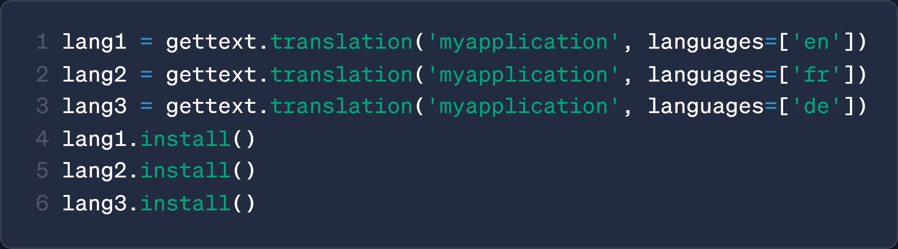

<div align="center">

<a href="https://github.com/z-mio/easy-ai18n">
    
</a>

**Simple and Elegant Python3 Internationalization (i18n) Tool**

[](https://www.python.org/)
[](https://github.com/z-mio/easy-ai18n)
[](https://github.com/z-mio/easy-ai18n)
[](https://badge.fury.io/py/easy-ai18n)
[](https://github.com/z-mio/easy-ai18n/blob/master/LICENSE)

English | [中文](README.zh.md) | [日本語](README.ja.md)

</div>

# 🌍 Easy AI18n

Easy AI18n is a modern internationalization tool library for Python3. It supports AI translation, multi-user scenarios, and full string formatting syntax,
making globalization of your project more elegant and natural.

## ✨ Key Features:

- **🚀 Easy to Use:** Implement i18n with just a few lines of code
- **✨ Elegant Syntax:** Use `_()` to wrap translatable texts, seamlessly integrating into your code
- **🤖 AI Translation:** Supports translation using large language models (LLMs) for high-quality results
- **📝 Full Formatting Support:** Fully supports all Python string formatting syntaxes
- **🌐 Multi-language Support:** Choose languages using `[]` selector for multilingual support

## 🔍 Comparison with Other i18n Tools

|                                             Other i18n Tools                                             |                                                         EasyAI18n                                                          |
|:--------------------------------------------------------------------------------------------------------:|:--------------------------------------------------------------------------------------------------------------------------:|
| <br/>**Requires manual maintenance of keys and i18n files, high development cost**  |        <br/>**Automatically extracts translation content, no manual file maintenance needed**         |
|                  <br/>**Supports only partial formatting syntax**                   |                             <br/>**Fully supports all formatting syntax**                             |
| <br/>**No real-time multi-language switching, unsuitable for multi-user scenarios** | <br/>**Supports default language and multi-language switching, adaptable to multi-user environments** |

---

## ⚡ Quick Start

### 📦 Installation

```shell
pip install easy-ai18n
```

### 🧪 Simple Example

`/i18n.py`

```python
from easy_ai18n import EasyAI18n

i18n = EasyAI18n()

_ = i18n.i18n()

if __name__ == "__main__":
    i18n.build(["ja"])
```

`/main.py`

```python
from i18n import _


def main():
    print(_("Hello, world!")['ja'])


if __name__ == "__main__":
    main()
```

## 🗂️ Project Structure

```text
easy_ai18n
├── core                 # Core functionality module
│   ├── builder.py       # Builder: extract, translate, generate YAML files
│   ├── i18n.py          # Main translation logic
│   ├── loader.py        # Loader: load translation files
│   └── parser.py        # AST parser
├── prompts              # Translation prompts
├── translator           # Translator module
└── main.py              # Project entry point
```

## 📘 Usage Tutorial

### 🛠️ Custom Translation Function Names

```python
from easy_ai18n import EasyAI18n

i18n = EasyAI18n(
    i18n_function_names=["_t", '_']  # Custom translation function names
)

_t = i18n.i18n()
_ = _t

print(_t("Hello, world!"))
print(_("Hello, world!"))
```

### 🤖 Use AI for Translation

```python
from easy_ai18n import EasyAI18n
from easy_ai18n.translator import OpenAIBulkTranslator

translator = OpenAIBulkTranslator(api_key=..., base_url=..., model='gpt-4o-mini')

i18n = EasyAI18n()
i18n.build(target_lang=["ru", "ja", 'zh-Hant'], translator=translator)

_ = i18n.i18n()

print(_("Hello, world!")['zh-Hant'])
```

### 🔎 Language Selector

```python
from easy_ai18n import EasyAI18n

i18n = EasyAI18n()
_ = i18n.i18n()
_t = _['ja']

d = {
    1: _('apple'),
    2: _('banana'),
    3: _t('orange'),
}
print(d[1]['zh-hans'])  # output: 苹果
print(d[2])  # output: banana
print(d[3])  # output: みかん
```

### 👥 Multi-user Language Scenarios (e.g. Telegram Bot)

Use custom language selector to dynamically select languages in multi-user environments:

`/i18n.py`:

```python
from pyrogram.types import Message
from easy_ai18n import EasyAI18n, PostLanguageSelector


class MyPostLanguageSelector(PostLanguageSelector):
    def __getitem__(self, msg: Message):
        # ......
        lang = msg.from_user.language_code
        return super().__getitem__(lang)


i18n = EasyAI18n()

_ = i18n.i18n(post_lang_selector=MyPostLanguageSelector)

if __name__ == "__main__":
    i18n.build(target_lang=['en', 'ru'])
```

`/bot.py`:

```python
from pyrogram import Client
from pyrogram.types import Message
from i18n import _

bot = Client("my_bot")


@bot.on_message()
async def start(__, msg: Message):
    await msg.reply(_[msg]("Hello, world!"))


if __name__ == "__main__":
    bot.run()
```