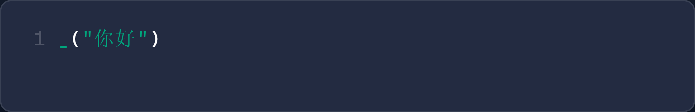
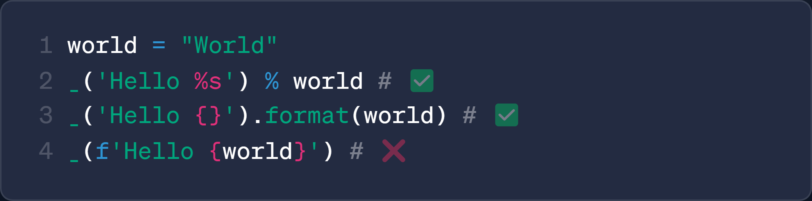

<div align="center">


**シンプルでエレガントな Python3 国際化 (i18n) ツール**

[](https://badge.fury.io/py/easy-ai18n)

[English](https://github.com/z-mio/easy-ai18n) | [中文](./README.zh.md) | 日本語

</div>

# 🌍 Easy AI18n

Easy AI18n は、Python3 向けのモダンな国際化ツールライブラリです。AI 翻訳、マルチユーザーシナリオ、完全な文字列フォーマット構文をサポートし、プロジェクトのグローバル化をよりエレガントかつ自然に実現します。

## ✨ 主な特徴:

- **🚀 簡単で使いやすい:** 数行のコードで国際化を実現
- **✨ エレガントな構文:** 翻訳対象のテキストを `_()` で囲むことで、コードに自然に統合
- **🤖 AI 翻訳:** 大規模言語モデル (LLM) を使った高品質な翻訳に対応
- **📝 フォーマット完全対応:** Python のすべての文字列フォーマット構文を完全サポート
- **🌐 多言語対応:** `[]` 言語セレクターで多言語を選択可能

## 🔍 他の i18n ツールとの比較

|                           他の i18n ツール                            |                           EasyAI18n                           |
|:----------------------------------------------------------------:|:-------------------------------------------------------------:|
| <br/>**`key` 㨠i18n ファイルを手動ã§ç®¡ç†ã™ã‚‹å¿…è¦ãŒã‚ã‚Šã€é–‹ç™ºã‚³ã‚¹ãƒˆãŒé«˜ã„** |          <br/>**翻訳内容を自動抽出ã€ãƒ•ã‚¡ã‚¤ãƒ«ç®¡ç†ä¸è¦**          |
|             <br/>**一部のフォーマット構文のみ対応**             |          <br/>**すべてのフォーマット構文に完全対応**           |
|     <br/>**リアルタイムの多言語切り替えができず、マルチユーザーに不向き**      | <br/>**デフォルト言語と多言語切り替えをサポート、マルチユーザー環境にも適応可能** |

---

## ⚡ クイックスタート

### 📦 インストール

```shell
pip install easy-ai18n
```

### 🧪 シンプルな例

```python
from easy_ai18n import EasyAI18n

i18n = EasyAI18n(target_lang=["ru", "ja", 'zh-CN'])
i18n.build()

_ = i18n.t()

print(_("Hello, world!")['zh-CN'])
```

## 🗂️ プロジェクト構成

```
easy_ai18n
├── core                 # コア機能モジュール
│   ├── builder.py       # ビルダー：抽出、翻訳、YAMLファイルの生成
│   ├── i18n.py          # 翻訳の主なロジック
│   ├── loader.py        # ローダー：翻訳ファイルの読み込み
│   └── parser.py        # AST 構文解析器
├── prompts              # 翻訳用プロンプト
├── translator           # 翻訳モジュール
└── main.py              # エントリーポイント
```

## 📘 使い方ガイド

### ⚙️ `EasyAI18n` インスタンスの初期化

```python
from easy_ai18n import EasyAI18n, PreLanguageSelector, PostLanguageSelector
from easy_ai18n.translator import GoogleTranslator

# EasyAI18n インスタンスの初期化
i18n = EasyAI18n(
    global_lang="zh",  # グローバルデフォルト言語
    target_lang=["zh", "ja"],  # 翻訳対象言語
    languages=["zh", "ja"],  # 有効な言語（デフォルトは target_lang）
    project_dir="/path/to/your/project",  # プロジェクトのルートディレクトリ
    include=[],  # 含めるファイル/ディレクトリ
    exclude=[".idea"],  # 除外するファイル/ディレクトリ
    i18n_file_dir="i18n",  # 翻訳ファイルの保存ディレクトリ
    func_name=["_"],  # 翻訳関数名（複数可）
    sep=" ",  # セパレーター（デフォルトはスペース）
    translator=GoogleTranslator(),  # 翻訳器（デフォルトは Google）
    pre_lang_selector=PreLanguageSelector,  # プリ言語セレクター
    post_lang_selector=PostLanguageSelector  # ポスト言語セレクター
)

# 翻訳ファイルのビルド
i18n.build()

# 翻訳関数を設定（ここでは _ を使用）
_ = i18n.t()

# 翻訳する文字列を関数に渡す
print(_("Hello, world!"))
```

### 🛠️ 翻訳関数名のカスタマイズ

```python
from easy_ai18n import EasyAI18n

i18n = EasyAI18n(
    func_name=["_t", '_']  # カスタム翻訳関数名
)

_t = i18n.t()
_ = _t

print(_t("Hello, world!"))
print(_("Hello, world!"))
```

### 🤖 AI による翻訳の利用

```python
from easy_ai18n import EasyAI18n
from easy_ai18n.translator import OpenAIYAMLTranslator

translator = OpenAIYAMLTranslator(api_key=..., base_url=..., model='gpt-4o-mini')

i18n = EasyAI18n(target_lang=["ru", "ja", 'zh-CN'], translator=translator)
i18n.build()

_ = i18n.t()

print(_("Hello, world!")['zh-CN'])
```

### 👥 マルチユーザー言語対応（例：Telegram Bot）

マルチユーザー環境で動的に言語を選択するには、カスタム言語セレクターを使用します：

```python
from pyrogram import Client
from pyrogram.types import Message

from easy_ai18n import EasyAI18n, PostLanguageSelector


class MyPostLanguageSelector(PostLanguageSelector):
    def __getitem__(self, msg: Message):
        # ユーザーの言語を取得
        lang = msg.from_user.language_code
        return super().__getitem__(lang)


i18n = EasyAI18n(
    target_lang=['zh', 'ru'],
    post_lang_selector=MyPostLanguageSelector,
)
_ = i18n.t()

bot = Client("my_bot")


@bot.on_message()
async def start(__, msg: Message):
    await msg.reply(_[msg]("Hello, world!"))


if __name__ == "__main__":
    bot.loop.run_until_complete(i18n.build_async())
    bot.run()
```

