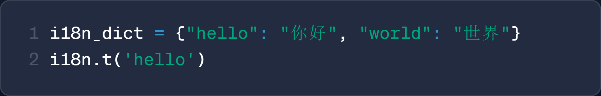

<div align="center">


**简单、优雅的 Python3 国际化(i18n)工具**

[](https://badge.fury.io/py/easy-ai18n)

[English](https://github.com/z-mio/easy-ai18n) | 中文 | [日本語](./README.ja.md)

</div>

# 🌍 Easy AI18n

Easy AI18n 是一款现代化的 Python3 国际化工具库，支持 AI 翻译、多用户场景以及完整的字符串格式化语法，让项目全球化变得更加优雅自然。

## ✨ 主要特性:

- **🚀 简单易用:** 几行代码即可轻松实现国际化
- **✨ 语法优雅:** 通过 `_()` 包裹待翻译文本，自然融入原有代码
- **🤖 AI 翻译:** 支持使用大语言模型（LLM）进行翻译，确保高质量结果
- **📝 格式化兼容:** 完整支持所有 Python 字符串格式化语法
- **🌐 多语言支持:** 通过 `[]` 语言选择器, 支持多语言选择

## 🔍 对比其他 i18n 工具

|                      其他 i18n 工具                      |                   EasyAI18n                   |
|:----------------------------------------------------:|:---------------------------------------------:|
| <br/>**需手动维护 `key` 与 i18n 文件，开发成本高** |  <br/>**自动提取翻译内容，无需手动维护文件**   |
|         <br/>**仅支持部分格式化语法**          |     <br/>**完全支持所有格式化语法**      |
|    <br/>**不支持实时多语言切换，不适用于多用户场景**     | <br/>**支持默认语言与多语言切换，适配多用户环境** |

---

## ⚡ 快速开始

### 📦 安装

```shell
pip install easy-ai18n
```

### 🧪 简单示例

```python
from easy_ai18n import EasyAI18n

i18n = EasyAI18n(target_lang=["ru", "ja", 'zh-CN'])
i18n.build()

_ = i18n.t()

print(_("Hello, world!")['zh-CN'])
```

## 🗂️ 项目结构

```
easy_ai18n
├── core                 # 核心功能模块
│   ├── builder.py       # 构建器：提取、翻译、生成 YAML 文件
│   ├── i18n.py          # 翻译主逻辑
│   ├── loader.py        # 加载器：加载翻译文件
│   └── parser.py        # AST 语法树解析器
├── prompts              # 翻译提示词
├── translator           # 翻译器模块
└── main.py              # 项目入口封装

```

## 📘 使用教程

### ⚙️ 初始化 `EasyAI18n` 实例

```python
from easy_ai18n import EasyAI18n, PreLanguageSelector, PostLanguageSelector
from easy_ai18n.translator import GoogleTranslator

# 初始化 EasyAI18n 实例
i18n = EasyAI18n(
    global_lang="zh",  # 全局默认语言
    target_lang=["zh", "ja"],  # 翻译目标语言
    languages=["zh", "ja"],  # 启用语言（默认为目标语言）
    project_dir="/path/to/your/project",  # 项目根目录（默认当前目录）
    include=[],  # 包含的文件/目录
    exclude=[".idea"],  # 排除的文件/目录
    i18n_file_dir="i18n",  # 存放翻译文件的目录
    func_name=["_"],  # 翻译函数名称（支持多个）
    sep=" ",  # 分隔符（默认空格）
    translator=GoogleTranslator(),  # 翻译器（默认 Google）
    pre_lang_selector=PreLanguageSelector,  # 前置语言选择器
    post_lang_selector=PostLanguageSelector  # 后置语言选择器
)

# 构建翻译文件
i18n.build()

# 设置翻译函数, 这里使用_, 可以自定义
_ = i18n.t()

# 将需要翻译的字符串放进翻译函数中
print(_("Hello, world!"))


```

### 🛠️ 自定义翻译函数名称

```python
from easy_ai18n import EasyAI18n

i18n = EasyAI18n(
    func_name=["_t", '_']  # 自定义翻译函数名称
)

_t = i18n.t()
_ = _t

print(_t("Hello, world!"))
print(_("Hello, world!"))
```

### 🤖 使用 AI 进行翻译

```python
from easy_ai18n import EasyAI18n
from easy_ai18n.translator import OpenAIYAMLTranslator

translator = OpenAIYAMLTranslator(api_key=..., base_url=..., model='gpt-4o-mini')

i18n = EasyAI18n(target_lang=["ru", "ja", 'zh-CN'], translator=translator)
i18n.build()

_ = i18n.t()

print(_("Hello, world!")['zh-CN'])
```

### 👥 多用户语言场景（如 Telegram Bot）

通过自定义语言选择器, 在多用户环境中实现动态语言选择:

```python
from pyrogram import Client
from pyrogram.types import Message

from easy_ai18n import EasyAI18n, PostLanguageSelector


class MyPostLanguageSelector(PostLanguageSelector):
    def __getitem__(self, msg: Message):
        # 获取用户语言
        lang = msg.from_user.language_code
        return super().__getitem__(lang)


i18n = EasyAI18n(
    target_lang=['zh', 'ru'],
    post_lang_selector=MyPostLanguageSelector,
)
_ = i18n.t()

bot = Client("my_bot")


@bot.on_message()
async def start(__, msg: Message):
    await msg.reply(_[msg]("Hello, world!"))


if __name__ == "__main__":
    bot.loop.run_until_complete(i18n.build_async())
    bot.run()
```